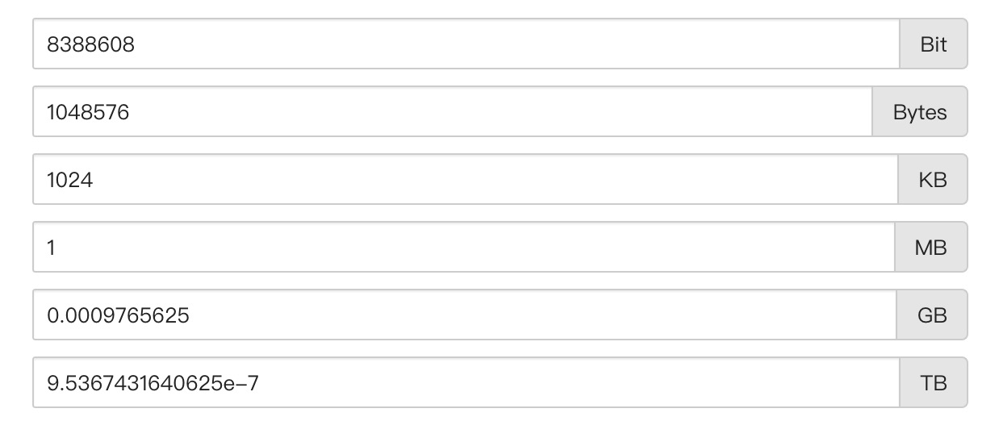

# cas-jvm

## java指令
    class解释称机器指令
    javap -v xxx.class | class -> 可读文件
    javac xxx.java     | java  -> class

## 编译器和JIT的区别
    编译器: 这个东西第一代jvm就有了，他可以解释字节码文件，但是效率不高，因为每次执行都会从头开始编译执行代码，消耗资源
    JIT: 这个东西呢就是解决上面编译器的难处，他提供了一个缓存，能够存储编译过后的机器码指令，这样就不用每次执行代码都去编译
         一次，他也只会缓存热点执行代码，避免缓存消耗也是对的。

## 历史
    现在市场常用的几个版本：HotSpot, JrRockit, J9

## JVM判断两个对象是否为一个对象
    1、包名和类型完全一致
    2、类加载器完全一致
    
--- ---
## 栈帧包含哪些组件
    1、局部变量表
        局部变量表中的变量也是重要的垃圾回收根节点，只要被局部变量表中直接或间接引用的对象都不回被回收
    
    2、操作数栈
                
    3、动态链接
        保存方法的引用信息，在常量池【常量池：指的是方法区里面的运行时常量池】中（静态常量在堆空间中，运行时常量池在虚拟机栈中）
    4、方法返回地址
        4.1、方法的调用：普通调用指令 
            1、invokestatic 调用静态方法，解析阶段确定唯一方法版本
            2、invokespecial 调用<init>方法、私有及弗雷方法，解析阶段确定唯一方法版本
            3、invokevirtual 调用所有虚方法
            4、invokeinterface 调用接口方法
        4.2、动态调用指令
            5、invokedynamic 动态解析出需要调用的方法，然后执行
        前四条指令固化虚拟机内部，方法的调用执行不可人为干扰，而invokedynamic指令则支持
        由用户确定方法版本。其中invokestatic指令和invokespecial指令调用的方法称为非虚方法，
        其余的(final修饰的除外)称为虚方法。
        4.3、非虚方法
            -如果方法在编译期就确定了具体的调用版本，这个版本在运行时是不可变的。
             这样的方法称为"非虚方法"
            -静态方法、私有方法、final方法、实例构造器、父类方法都是非 
        4.4、调用者的pc计数器的值作为返回地址，即调用该方法的指令的下一条指令的地址
            * 正常完成出口和异常完成出口的区别在于：通过异常完成出口退出的不会给他的上层调用者产生任何的返回值。
            
    5、一些附加信息
        对程序调试提供的信息

## 本地方法
    一个Native method就是一个java调用非java代码的接口，该方法是非java语言实现。
    

## 堆
    一个java程序对应一个进程
    一个进程对应一个jvm实例
    一个jvm实例中只有一个运行时数据区
    一个运行时数据区只有一个方法区和堆
    一个进程中的多个线程需要共享同一个方法区，堆空间
    每一个线程拥有独立的一套程序计数器，本地方法栈，虚拟机栈

    默认堆空间大小
        初始内存大小：物理电脑内存大小 / 64
        最大内存大小：物理电脑内存大小 / 4

    查看堆空间使用情况
    1、 jps -> jstat -gc 进程号 
    2、 -XX:+printGCDetails

    jdk8
    存放 stringTable和静态常量

## 代码优化之栈上分配
    JIT编译器在编译期间根据逃逸分析的结果，发现如果一个对象并没有逃逸出方法的话，就可能被优化成栈上分配。
    分配完成后，继续在调用栈内执行，最后线程结束，栈空间被回收，局部变量对象也被回收。这样就无须进行垃圾回收了。
    
    常见的栈上分配的场景
    在逃逸分析中，已经说明了。分别是给成员变量赋值，方法返回值，实例引用传递。

## 锁消除
    1、线程同步的代价是相当高的，同步的后果是降低并发性和性能
    2、在动态编译同步块的时候，JIT编译器可以借助逃逸分析来判断同步块所使用的锁对象是否只能被一个
    线程访问而没有被发布到其他线程。如果没有，那么JIT编译器在编译这个同步块的时候就会取消这部分代码的
    同步。这样就能大大提高并发性和性能。这样取消同步的过程就叫同步省略，也叫锁消除。

## 方法区
    如何设置方法区的大小
    1、方法区的大小不必是固定的，jvm可以根据应用动态调整
       用于存储已被虚拟机加载的类型信息，常量，静态变量，即使编译器编译后的代码缓存
    
    jdk8及以后：
        元数据区大小可以使用参数-XX:MetaspaceSize和-XX:MaxMetaspaceSize指定，替代上述原有的两个参数。
        默认值依赖于平台。windows下，-XX:MetaspaceSize是21M，-XX:MaxMetaspaceSize 的值是-1，即没有限制
        我们一般推荐将初始默认值设置为一个较高的值
        
        与永久代不同，如果不指定大小，默认情况下，虚拟机会耗尽所有的可用系统内存。如果元数据区发生溢出，虚拟机一样会抛出
        异常OutOfMemoryError:Metaspace
        
        -XX:MetaspaceSize: 设置初始的元空间大小。对于一个64位的服务器端JVM来说，其默认的
        -XX:MetaspaceSize值位21MB。这就是初始的高水位线，一旦触及这个水位线，Full GC将会被触发并卸载
        没用的类（即这些类对应的类加载器不再存活），然后这个高水位线将会重置。新的高水位线的值取决于GC后释放了多少元空间 。
        如果释放的空间不足，那么在不超过MaxMetaspaceSize时，适当提高该值。如果释放空间过多，则适当降低该值。
        
        如果初始化的高水位线设置过低，上述高水位线调整情况会发生很多次。通过垃圾回收器的日志可以
        观察到Full GC多次调用。为了避免频繁地GC，建议将-XX:MetaspaceSize设置为一个相对较高的值。
        
     方法区的垃圾收集主要回收两部分内容：常量池中废弃的常量和不再使用的类型

## 永久代为什么要被元空间替换
    1、为永久代设置空间大小是很难确定的
        在某些场景下，如果动态加载类过多，容易产生Perm区的OOM。比如某个实际Web工程中，
        因为功能点比较多，在运行过程中，要不断动态加载很多类，经常出现致命错误。
        
    2、对永久代调优是很困难的

## StringTable为什么要调整？
    jdk7中将StringTable放到了堆空间中。因为永久代的回收效率很低，在full gc的时候才会触发。而full gc是老年代的空间不足、
    永久代不足时才会触发。
    这就导致stringTable回收效率不高。而我们开发中会有大量的字符串被创建，回收效率低，导致永久代内存不足。放到堆里，能及时回收内存。

## 如何解决这些OOM?
    1、要解决OOM异常或heap space的异常，一般的手段是首先通过内存映像分析工具对dump出来的堆转储快照进行分析，重点是确认确认内存
    中的对象是否是必要的，也就是要先分清楚到底是出现了内存泄漏（Memory Leak）还是内存溢出（Memory Overflow）。
    
    2、如果是内存泄露，可进一步通过工具查看泄漏对象到GC Roots的引用链。于是就能找到泄漏对象是通过怎样的路径与GC Roots相关联并导致垃圾收集器无法自动回收
    他们的。掌握了泄漏对象的类型信息，以及GC Roots引用链的信息，就可以比较准确地定位出泄漏代码的位置。
    
    3、如果不存在内存泄漏，换句话说就是内存中的对象确实都还必须存活着，那就应当检查虚拟机的堆参数（-Xmx | -Xms） ,与机器物理内存对比看是否还可以调大，从代码上
    检查是否存在某些生命周期过长，持有状态时间过长的情况，尝试减少程序运行期的内存消耗。
    

--- --- 

## 创建对象的方式
    1、new
    2、Class的newInstance():反射的方式，只能调用空参的构造器，权限必须是public
    3、Constructor的newInstance(Xxx):反射的方式，可以调用空餐，带参的构造器，权限没有要求
    4、使用clone(),不调用任何构造器，当前类实现Cloneable接口，实现clone()
    5、使用反序列化，从文件中，网络中获取一个对象的二进制流
    6、第三方库Objenesis
    
## JVM是如何通过栈帧中的对象引用访问到其内部的对象实例的呢？
    定位，通过reference访问

## 对象访问方式主要有集中
    1、句柄访问
        缺点：实例数据需要两次跳转获得
        优点：reference中存储稳定句柄地址，对象被移动（垃圾收集时移动对象很普遍）时只会改变句柄实例数据指针即可，reference本身不需要被修改。
        
    2、直接访问
        优点：实例数据一次跳转即可获得
--- ---
#### java进程内存 = java 堆内存 + 本地内存

## 执行引擎
    执行引擎的任务就是将字节码指令解释/编译为对应平台上的本地机器指令才可以

## 什么时解释器，什么是JIT编译器？
#### 解释器
    解释器：当Java虚拟机启动时会根据预定义的规范对字节码采用逐行解释的方式执行，
    将每条字节码文件中的内容"翻译"为对应平台的本地机器指令执行。

#### JIT编译器
    就是虚拟机将源代码直接编译成和本地机器平台相关的机器语言
    
    解释器和编译器之后的语言都是机器语言，就是机器可以直接执行的语言

#### 为什么jvm还需要解释器，既然编译器的性能这么高
    有些开发人员会感觉到诧异，既然hotspot vm中已经内置jit编译器了，那么为什么还需要再使用解释器来
    "拖累"程序的执行性能呢？比如JRockit vm内部就不包含解释器，字节码全部都依靠即时编译器编译后执行。
    
    首先明确：
        当程序启动后，解释器可以马上发挥作用，省去编译的时间，立即执行。
        编译器要想发挥作用，把代码编译成本地代码，需要一定的执行时间。但编译为本地代码后，执行效率高。
    所以
        尽管Jrockit vm中程序的执行性能会非常高效，但程序再启动时必然需要花费更长的时间来进行编译。
        对于服务端应用来说，启动时间并非是关注重点，但对于那些看中启动时间的应用场景而言，或许就需要采用
        解释器和即时编译器并存的架构来换取一个平衡点。
    在此模式下
        当java虚拟机启动时，解释器可以首先发挥作用，而不必等待即时编译器全部编译完成后再执行，这样可以省去许多不必要的编译时间。
        随着时间的推移，编译器发挥作用，把越来越多的代码编译成本地代码，获得更高的执行效率。
    同时
        解释执行在编译器进行激进优化不成立的时候，作为编译器的"逃生门"。

#### 怎么判断用解释器还是用即时编译器
    即时编译器判断规则
        1、调用计数（规定时间内被调用指定次数）
        2、回边计数（循环体循环计数达到执行次数）
        
        
## 字符串常量池中是不会存储相同内容的字符串的？
    1、String 的 String pool 是一个固定大小的hashtable，默认值大小长度是1009。如果放进String Pool的String非常多，
    就会造成Hash冲突严重，从而导致链表会很长，而链表长了会直接造成的影响就是当调用String.intern时性能会大幅下降（intern()方法会寻找字符串，没有则创建）
    
    2、使用-XX:StringTableSize=1009可设置StringTable长度
    3、在jdk6中StringTable是固定的，就是1009的长度，所以如果常量池中的字符串过多会导致效率下降很快。StringTableSize设置没有要求
    4、在jdk7中，StringTable的长度默认是60013，StringTableSize设置没有要求
    5、jdk8开始，设置StringTable长度的话，1009是可设置的最小值，设置小了直接报错。

## 总结String的intern()的使用
    jdk6中，将这个字符串对象尝试放入串池。
    1、如果串池中有，则并不会放入。返回已有的串池中的对象的地址
    2、如果没有，会把此对象复制一份，放入串池，并返回串池中的对象地址
    
    jdk7开始，将这个字符串对象尝试放入串池。
    1、如果串池中有，则并不会放入。返回已有的串池的对象的地址。
    2、如果没有，则会把对象的引用地址复制一份，放入串池，并返回串池中的引用地址。
    
## 定义垃圾
    就是没有指针指向的聚合对象，基本数据类型（标量对象）不考虑
    
## 判断对象死亡的方式
    1、引用计数法
    优点：实现简单，垃圾对象便于辨识，判断效率高，回收没有延迟性
    缺点：无法解决循环引用的问题
    
    2、可达性算法
    优点：能解决引用计数法中的循环引用的问题
    缺点：暂无
    哪些作为GC Roots?
    1、虚拟机栈中引用的对象
    2、本地方法栈中引用的对象
    3、方法区中类静态属性引用的对象
    4、方法区中常量引用的对象
    5、所有被同步锁sysnchronized持有的对象
    6、java虚拟机内部的引用
    7、反映java虚拟机内部情况的JMXBean、JVMTI中注册的回调，本地代码缓存等。
    
    小技巧：由于Root采用栈方式存放变量和指针，所以如果一个指针，它保存了堆空间里面的对象，但是自己又不存放在堆内存里面，那它就是一个Root

    对象被标记为不可达，不一定会死，在finalize()可能被救活，除此之外一定会死
    
    
### 垃圾回收算法
    标记-清除：老年代混合使用
    复制算法：用于to和from区
    标记-整理：老年代混合使用

## 参数
    -Xss258k == 虚拟机栈大小
    -Xms10m  == java堆初始大小
    -Xmx10m  == java堆最大大小
    -XX:NewRatio == 设置新生代与老年代的比例。默认值是2
    -XX:SurvicorRatio == 设置新生代中Eden区与Survivor区的比例,默认值是8
    -XX:-UseAdaptiveSizePolicy == 关闭自适应的内存分配策略
    -Xmn == 设置新生代的空间大小（优先级高,一般不设置）
    -XX:MaxTenuringThreshold == 最大新生代年龄晋升阀值
    -XX:+PrintGCDetails == 打印详细的GC处理日志
    -XX:+/- UseTLAB == 设置是否开启TLAB空间（默认开启）
    -XX:TLABWasteTargetPercent == 设置TLAB空间所占Eden空间的百分比大小
    -XX:+PrintFlagsInitial == 查看所有的参数的默认初始值
    -XX:+PrintFlagsFinal == 查看所有的参数的最终值
    -XX:HandlePromotionFailure == 是否设置空间分配担保
    -XX:+DoEscapeAnalysis == 显式开启逃逸分析
    -XX:+PrintEscapeAnalysis == 查看逃逸分析的筛选结果
    -XX:+EliminateAllocations == 开启标量替换（默认打开）
    -XX:MetaspaceSize == 指定元空间大小
    -XX:MaxMetaspaceSize == 最大元空间大小
    -Xnoclassgc == 控制方法区的无用类型是否被允许回收
    -verbose:class -XX:+TraceClass-Loading -XX:+TraceClassUnLoading == 查看类加载和卸载信息
    -XX:MaxDirectMemorySize=10m == 设置最大直接内存大小
    -XX:CompileThreshold == 设置计数器用于统计被嗲用的次数
    -XX:+/-UseCounterDecay == 开启/关闭热度衰减，让方法计数器统计方法调用的绝对次数，这样，只要运行时间够长，绝大部分方法都会被编译成本地代码
    -XX:CounterHalfLifeTime == 参数设置半衰周期的时间，单位是秒
    -Xint == 完全采用编译器模式执行程序
    -Xcomp == 完全采用即时编译器模式执行程序。如果即时编译出现问题，解释器回介入执行
    -Xmixed == 采用解释器+即时编译器的混合模式共同执行程序
    -XX:StringTableSize == 设置StringTable的长度（HashTable，越长时间越短，空间换时间）
    -XX:+HeapDumpOnOutOfMemoryError == OOM时生成dump文件开启

### Jconsole 远程监控JVM
    启动参数中加入如下参数
    java 
    -Djava.rmi.server.hostname=10.160.13.111  #远程服务器ip，即本机ip
    -Dcom.sun.management.jmxremote #允许JMX远程调用
    -Dcom.sun.management.jmxremote.port=3214  #自定义jmx 端口号
    -Dcom.sun.management.jmxremote.ssl=false  # 是否需要ssl 安全连接方式
    -Dcom.sun.management.jmxremote.authenticate=false #是否需要秘钥
     -jar test.jar 
     
     案例：启动参数
     -bash-4.2# cat start.sh 
     #!/bin/sh
     java  -jar -Dspring.profiles.active=prd -Djava.rmi.server.hostname=172.16.116.155 -Dcom.sun.management.jmxremote -Dcom.sun.management.jmxremote.port=3214 -Dcom.sun.management.jmxremote.ssl=false -Dcom.sun.management.jmxremote.authenticate=false cas-redis-0.0.1-SNAPSHOT.jar & 
     -bash-4.2# 
     
     用命令敲jconsole,再弹出的页面选择远程调用方式，输入ip+配置端口 ，再输入linux用户名和密码即可

### jvm 指令操作
    jinfo:可以输出并修改运行时的java 进程的opts。 (可以修改运行时参数)
    jps:与unix上的ps类似，用来显示本地的java进程，可以查看本地运行着几个java程序，并显示他们的进程号。 
    jstat:一个极强的监视VM内存工具。可以用来监视VM内存内的各种堆和非堆的大小及其内存使用量。 
    jmap:打印出某个java进程（使用pid）内存内的所有'对象'的情况（如：产生那些对象，及其数量）。 
    jconsole:一个java GUI监视工具，可以以图表化的形式显示各种数据。并可通过远程连接监视远程的服务器VM。 

### jinfo
    -bash-4.2# jinfo -help
    Usage:
        jinfo [option] <pid>
            (to connect to running process)
        jinfo [option] <executable <core>
            (to connect to a core file)
        jinfo [option] [server_id@]<remote server IP or hostname>
            (to connect to remote debug server)
    
    where <option> is one of:
        -flag <name>         to print the value of the named VM flag
        -flag [+|-]<name>    to enable or disable the named VM flag
        -flag <name>=<value> to set the named VM flag to the given value
        -flags               to print VM flags
        -sysprops            to print Java system properties
        <no option>          to print both of the above
        -h | -help           to print this help message

#### 查看JVM参数[jinfo -flags process_id] 
```bash
-bash-4.2# jps
1987 jar
2083 Jps
-bash-4.2# jinfo -flags 1987
Attaching to process ID 1987, please wait...
Debugger attached successfully.
Server compiler detected.
JVM version is 25.291-b10
Non-default VM flags: -XX:CICompilerCount=2 -XX:InitialHeapSize=48234496 -XX:+ManagementServer -XX:MaxHeapSize=742391808 -XX:MaxNewSize=247463936 -XX:MinHeapDeltaBytes=524288 -XX:NewSize=15728640 -XX:OldSize=32505856 -XX:+UseCompressedClassPointers -XX:+UseCompressedOops -XX:+UseFastUnorderedTimeStamps -XX:+UseParallelGC 
Command line:  -Dspring.profiles.active=prd -Djava.rmi.server.hostname=172.16.116.155 -Dcom.sun.management.jmxremote -Dcom.sun.management.jmxremote.port=3214 -Dcom.sun.management.jmxremote.ssl=false -Dcom.sun.management.jmxremote.authenticate=false
-bash-4.2# 
```    

#### 查看Java系统参数[jinfo -sysprops process_id]
```bash
-bash-4.2# jinfo -sysprops 1987
Attaching to process ID 1987, please wait...
Debugger attached successfully.
Server compiler detected.
JVM version is 25.291-b10

com.sun.management.jmxremote.authenticate = false
java.runtime.name = Java(TM) SE Runtime Environment
java.vm.version = 25.291-b10
sun.boot.library.path = /usr/local/jdk1.8.0_291/jre/lib/amd64
java.protocol.handler.pkgs = org.springframework.boot.loader
java.vendor.url = http://java.oracle.com/
java.vm.vendor = Oracle Corporation
path.separator = :
java.rmi.server.randomIDs = true
file.encoding.pkg = sun.io
java.vm.name = Java HotSpot(TM) 64-Bit Server VM
sun.os.patch.level = unknown
sun.java.launcher = SUN_STANDARD
user.country = CN
user.dir = /app/cas-redis
java.vm.specification.name = Java Virtual Machine Specification
com.sun.management.jmxremote.port = 3214
PID = 1987
java.runtime.version = 1.8.0_291-b10
java.awt.graphicsenv = sun.awt.X11GraphicsEnvironment
os.arch = amd64
java.endorsed.dirs = /usr/local/jdk1.8.0_291/jre/lib/endorsed
CONSOLE_LOG_CHARSET = UTF-8
spring.profiles.active = prd
line.separator = 

java.io.tmpdir = /tmp
java.vm.specification.vendor = Oracle Corporation
os.name = Linux
FILE_LOG_CHARSET = UTF-8
sun.jnu.encoding = UTF-8
java.library.path = /usr/java/packages/lib/amd64:/usr/lib64:/lib64:/lib:/usr/lib
spring.beaninfo.ignore = true
sun.nio.ch.bugLevel = 
java.specification.name = Java Platform API Specification
java.class.version = 52.0
sun.management.compiler = HotSpot 64-Bit Tiered Compilers
os.version = 3.10.0-1160.31.1.el7.x86_64
user.home = /root
user.timezone = Asia/Shanghai
catalina.useNaming = false
java.awt.printerjob = sun.print.PSPrinterJob
file.encoding = UTF-8
java.specification.version = 1.8
catalina.home = /tmp/tomcat.9003.7652248120191127807
user.name = root
java.class.path = cas-redis-0.0.1-SNAPSHOT.jar
com.sun.management.jmxremote = 
java.vm.specification.version = 1.8
sun.arch.data.model = 64
sun.java.command = cas-redis-0.0.1-SNAPSHOT.jar
java.home = /usr/local/jdk1.8.0_291/jre
user.language = zh
java.specification.vendor = Oracle Corporation
awt.toolkit = sun.awt.X11.XToolkit
com.sun.management.jmxremote.ssl = false
java.vm.info = mixed mode
java.version = 1.8.0_291
java.ext.dirs = /usr/local/jdk1.8.0_291/jre/lib/ext:/usr/java/packages/lib/ext
sun.boot.class.path = /usr/local/jdk1.8.0_291/jre/lib/resources.jar:/usr/local/jdk1.8.0_291/jre/lib/rt.jar:/usr/local/jdk1.8.0_291/jre/lib/sunrsasign.jar:/usr/local/jdk1.8.0_291/jre/lib/jsse.jar:/usr/local/jdk1.8.0_291/jre/lib/jce.jar:/usr/local/jdk1.8.0_291/jre/lib/charsets.jar:/usr/local/jdk1.8.0_291/jre/lib/jfr.jar:/usr/local/jdk1.8.0_291/jre/classes
java.awt.headless = true
java.vendor = Oracle Corporation
catalina.base = /tmp/tomcat.9003.7652248120191127807
file.separator = /
java.vendor.url.bug = http://bugreport.sun.com/bugreport/
sun.io.unicode.encoding = UnicodeLittle
sun.cpu.endian = little
java.rmi.server.hostname = 172.16.116.155
sun.cpu.isalist = 
```
    
### jstat
    -bash-4.2# jstat -help
    Usage: jstat -help|-options
           jstat -<option> [-t] [-h<lines>] <vmid> [<interval> [<count>]]
    
    Definitions:
      <option>      An option reported by the -options option
      <vmid>        Virtual Machine Identifier. A vmid takes the following form:
                         <lvmid>[@<hostname>[:<port>]]
                    Where <lvmid> is the local vm identifier for the target
                    Java virtual machine, typically a process id; <hostname> is
                    the name of the host running the target Java virtual machine;
                    and <port> is the port number for the rmiregistry on the
                    target host. See the jvmstat documentation for a more complete
                    description of the Virtual Machine Identifier.
      <lines>       Number of samples between header lines.
      <interval>    Sampling interval. The following forms are allowed:
                        <n>["ms"|"s"]
                    Where <n> is an integer and the suffix specifies the units as 
                    milliseconds("ms") or seconds("s"). The default units are "ms".
      <count>       Number of samples to take before terminating.
      -J<flag>      Pass <flag> directly to the runtime system.

####  查看加载class的数量，及所占空间等信息【jstat -class pid】
```bash
-bash-4.2# jstat -class 1987
Loaded  Bytes  Unloaded  Bytes     Time   
 10257 18543.0        0     0.0       3.49
```

#### 显示VM实时编译的数量等信息【jstat -compiler pid】
```bash
-bash-4.2# jstat -compiler 1987
Compiled Failed Invalid   Time   FailedType FailedMethod
    5023      1       0     5.91          1 sun/misc/URLClassPath$JarLoader getResource
```

#### 可以显示gc的信息，查看gc的次数、时间【jstat -gc pid】
```bash
# 其中最后五项，分别是young gc的次数，young gc的时间，full gc的次数，full gc的时间，gc的总时间。 
-bash-4.2# jstat -gc 1987
 S0C    S1C    S0U    S1U      EC       EU        OC         OU       MC     MU    CCSC   CCSU   YGC     YGCT    FGC    FGCT     GCT   
9728.0 10752.0 9608.1  0.0   220160.0 205103.6  43520.0    12960.8   48856.0 46183.3 6616.0 6135.9     12    0.098   2      0.079    0.177
```

#### 显示VM内存中三代（young，old，perm）对象的使用和占用大小
    PGCMN显示的是最小perm的内存使用量，PGCMX显示的是perm的内存最大使用量，PGC是当前新生成的perm内存占用量，PC是但前perm内存占用量。其他的可以根据这个类推， OC是old内纯的占用量。 
```bash
-bash-4.2# jstat -gccapacity 1987
 NGCMN    NGCMX     NGC     S0C   S1C       EC      OGCMN      OGCMX       OGC         OC       MCMN     MCMX      MC     CCSMN    CCSMX     CCSC    YGC    FGC 
 15360.0 241664.0 241664.0 9728.0 10752.0 220160.0    31744.0   483328.0    43520.0    43520.0      0.0 1091584.0  48856.0      0.0 1048576.0   6616.0     12     2
```

#### new对象的信息
```bash
-bash-4.2# jstat -gcnew 1987
 S0C    S1C    S0U    S1U   TT MTT  DSS      EC       EU     YGC     YGCT  
9728.0 10752.0 9608.1    0.0  1  15 10752.0 220160.0 205103.6     12    0.098
```

#### new对象的信息
```bash
-bash-4.2# jstat -gcnew 1987
 S0C    S1C    S0U    S1U   TT MTT  DSS      EC       EU     YGC     YGCT  
9728.0 10752.0 9608.1    0.0  1  15 10752.0 220160.0 205103.6     12    0.098
```

### jmp

#### 查看概要信息【jmap -heap pid】
```bash
-bash-4.2# jmap -heap 1987
Attaching to process ID 1987, please wait...
Debugger attached successfully.
Server compiler detected.
JVM version is 25.291-b10

using thread-local object allocation.
Parallel GC with 2 thread(s)

Heap Configuration:
   MinHeapFreeRatio         = 0
   MaxHeapFreeRatio         = 100
   MaxHeapSize              = 742391808 (708.0MB)
   NewSize                  = 15728640 (15.0MB)
   MaxNewSize               = 247463936 (236.0MB)
   OldSize                  = 32505856 (31.0MB)
   NewRatio                 = 2
   SurvivorRatio            = 8
   MetaspaceSize            = 21807104 (20.796875MB)
   CompressedClassSpaceSize = 1073741824 (1024.0MB)
   MaxMetaspaceSize         = 17592186044415 MB
   G1HeapRegionSize         = 0 (0.0MB)

Heap Usage:
PS Young Generation
Eden Space:
   capacity = 225443840 (215.0MB)
   used     = 210777584 (201.01316833496094MB)
   free     = 14666256 (13.986831665039062MB)
   93.49449689998183% used
From Space:
   capacity = 9961472 (9.5MB)
   used     = 9838704 (9.382919311523438MB)
   free     = 122768 (0.1170806884765625MB)
   98.7675717002467% used
To Space:
   capacity = 11010048 (10.5MB)
   used     = 0 (0.0MB)
   free     = 11010048 (10.5MB)
   0.0% used
PS Old Generation
   capacity = 44564480 (42.5MB)
   used     = 13271848 (12.657020568847656MB)
   free     = 31292632 (29.842979431152344MB)
   29.781224867876837% used

18247 interned Strings occupying 1569784 bytes.
```
#### MB数据转换，1Mb = 100万bytes大约


#### 查看对象【jmap -histo pid】
```bash
-bash-4.2# jmap -histo 1987

 num     #instances         #bytes  class name
----------------------------------------------
   1:        434151       84956976  [C
   2:         31310       69555888  [I
   3:         67252       25864576  [B
   4:        282895        6789480  java.lang.String
   5:         90911        5228072  [Ljava.lang.Object;
   6:         40588        2597632  java.net.URL
   7:         26172        2303136  java.lang.reflect.Method
   8:         80180        1687984  [Ljava.lang.Class;
   9:         17006        1365088  [Ljava.util.WeakHashMap$Entry;
  10:         10948        1201120  java.lang.Class
  11:         36658        1173056  java.util.concurrent.ConcurrentHashMap$Node
  12:         16840        1077760  org.springframework.boot.loader.jar.JarFileWrapper
  13:         32389        1036448  org.springframework.boot.loader.jar.StringSequence
  14:         23750         950000  java.lang.ref.Finalizer
  15:         12702         946656  [S
  16:         10654         889256  [Ljava.util.HashMap$Node;
  17:         16995         815760  java.util.WeakHashMap
  18:         32389         777336  org.springframework.boot.loader.jar.JarURLConnection$JarEntryName
  19:         24284         777088  java.io.ObjectStreamClass$WeakClassKey
  20:         19010         760400  java.util.LinkedHashMap$Entry
  21:         22028         704896  java.util.HashMap
```

#### 导出dump并分析【jmap -dump:format=b,file=path/heap.hprof 1987】


#### 查看gc实时【jstat -gcutil  1987  1000 100】1000毫秒 100次
    时间戳记-自目标JVM启动时间以来的时间（以秒为单位）。
    S0C –幸存者0区域的容量，以KB为单位
    S1C –幸存者1区域的容量，以KB为单位
    S0U –幸存者0区域使用的空间以KB为单位
    S1U –幸存者1区域以KB为单位使用空间
    EC –伊甸园地区容量（KB）
    欧盟–伊甸园地区的已利用空间（以KB为单位）
    OC –旧区域容量（KB）
    OU –旧区域的已利用空间，以KB为单位
    MC –元空间区域容量（KB）
    MU –元空间区域以KB为单位的使用空间
    CCSC –压缩类空间区域的容量，以KB为单位
    CCSU –压缩类空间区域以KB为单位使用空间
    YGC –迄今为止发生的年轻GC事件的数量
    YGCT –到目前为止，年轻GC花费的时间
    FGC –迄今为止已发生的完全GC事件的数量
    FGCT –到目前为止已花费的完整GC时间
    GCT –到目前为止所花费的GC时间总量（基本上是YGCT + FGCT）
    
```bash
-bash-4.2# jstat -gcutil  1987  1000 100
  S0     S1     E      O      M     CCS    YGC     YGCT    FGC    FGCT     GCT   
 98.77   0.00  93.49  29.78  94.53  92.74     12    0.098     2    0.079    0.177
 98.77   0.00  93.49  29.78  94.53  92.74     12    0.098     2    0.079    0.177
 98.77   0.00  93.49  29.78  94.53  92.74     12    0.098     2    0.079    0.177
 98.77   0.00  93.49  29.78  94.53  92.74     12    0.098     2    0.079    0.177
 98.77   0.00  93.49  29.78  94.53  92.74     12    0.098     2    0.079    0.177
 98.77   0.00  93.49  29.78  94.53  92.74     12    0.098     2    0.079    0.177
 98.77   0.00  93.49  29.78  94.53  92.74     12    0.098     2    0.079    0.177
 98.77   0.00  93.49  29.78  94.53  92.74     12    0.098     2    0.079    0.177
 98.77   0.00  93.49  29.78  94.53  92.74     12    0.098     2    0.079    0.177
 98.77   0.00  93.49  29.78  94.53  92.74     12    0.098     2    0.079    0.177
 98.77   0.00  93.49  29.78  94.53  92.74     12    0.098     2    0.079    0.177
```

### 查看所有的参数【java -XX:+PrintFlagsFinal】


